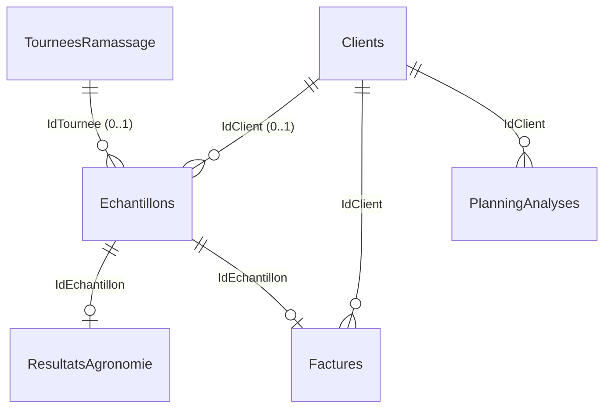

# Base de données

Récapitulatif du schéma SQL Server (LocalDB en développement) géré par EF Core. Source de vérité : les configurations de [src/erpWeb.Infrastructure/Donnees/Configurations/](../src/erpWeb.Infrastructure/Donnees/Configurations/) et les migrations de [src/erpWeb.Infrastructure/Donnees/Migrations/](../src/erpWeb.Infrastructure/Donnees/Migrations/). Les tests unitaires utilisent SQLite en mémoire (les contraintes CHECK y sont retirées).

## Conventions

- Noms de tables et de colonnes en français, sans accents ni abréviations.
- Les entités auditables (`EntiteAuditable`) portent `Id` (int, identité), `DateCreation`, `CreePar` (nvarchar(256)), `DateModification` (nullable) et `ModifiePar` (nvarchar(256), nullable), renseignés par l'intercepteur d'audit. Ces colonnes ne sont pas répétées ci-dessous (« + audit »).
- Les clés étrangères vers les données métier sont en `Restrict` : supprimer un parent ne supprime jamais silencieusement ses enfants. Seule exception : `ResultatsAgronomie` (cascade depuis `Echantillons`).
- Les dates sans heure sont de type `date` (`DateOnly`).

## Schéma des relations

Les tables `Documents` et `JournalAudit` désignent leur entité par `TypeEntite` + `IdEntite` (texte), sans clé étrangère.

## Tables métier

### Clients

| Colonne | Type | Null | Remarque |
| --- | --- | --- | --- |
| RaisonSociale | nvarchar(100) | non | index |
| Adresse1, Adresse2 | nvarchar(200) | oui | |
| CodePostal | nvarchar(10) | oui | |
| Ville | nvarchar(100) | oui | |
| Pays | nvarchar(50) | oui | |
| Telephone1, Telephone2 | nvarchar(12) | oui | enregistrés sans espaces ni points |
| Email | nvarchar(100) | oui | |

+ audit.

### TourneesRamassage

| Colonne | Type | Null | Remarque |
| --- | --- | --- | --- |
| DateTournee | date | non | index |
| NomChauffeur | nvarchar(50) | non | |
| ImmatriculationCamion | nvarchar(15) | oui | |
| StatutTemperature | nvarchar(20) | oui | |

+ audit.

### Echantillons

| Colonne | Type | Null | Remarque |
| --- | --- | --- | --- |
| CodeBarresAnonyme | nvarchar(50) | non | index unique |
| DatePrelevement | datetime2 | non | |
| Filiere | nvarchar(30) | non | |
| StatutAnalyse | nvarchar(20) | non | `Recu`, `EnCours`, `Termine` |
| TemperatureReception | decimal(5,2) | oui | CHECK entre -10 et 100 |
| IdTournee | int | oui | FK → TourneesRamassage (Restrict), index |
| IdClient | int | oui | FK → Clients (Restrict), index |

+ audit.

### ResultatsAgronomie

Relation 1-1 avec `Echantillons`.

| Colonne | Type | Null | Remarque |
| --- | --- | --- | --- |
| IdEchantillon | int | non | FK → Echantillons (**Cascade**), index unique |
| TypeSupport | nvarchar(50) | oui | |
| PhSol | decimal(4,2) | oui | |
| MatiereOrganique | decimal(6,3) | oui | |
| PhosphoreP2O5 | decimal(8,3) | oui | |
| PotassiumK2O | decimal(8,3) | oui | |
| ReliquatAzoteN | decimal(8,3) | oui | |
| ValeurUclFourrage | decimal(6,3) | oui | |
| DateValidation | datetime2 | oui | |

+ audit.

### Factures

Une facture par échantillon ; les coordonnées du client sont figées à la génération.

| Colonne | Type | Null | Remarque |
| --- | --- | --- | --- |
| IdEchantillon | int | non | FK → Echantillons (Restrict), index unique |
| NumeroFacture | int | non | index unique, séquentiel |
| DateFacture | date | non | index |
| DateEcheance | date | oui | |
| IdClient | int | non | FK → Clients (Restrict), index |
| NomClient | nvarchar(100) | non | copie figée |
| AdresseFacturation | nvarchar(255) | oui | copie figée |
| CodePostal | nvarchar(10) | oui | copie figée |
| Ville | nvarchar(80) | oui | copie figée |
| Pays | nvarchar(50) | oui | copie figée |
| ModePaiement | nvarchar(30) | oui | |
| MontantHorsTaxe | decimal(12,2) | non | CHECK ≥ 0 |
| TauxTva | decimal(5,2) | non | |
| MontantTva | decimal(12,2) | non | CHECK ≥ 0 |
| MontantToutesTaxesComprises | decimal(12,2) | non | CHECK ≥ 0 |
| Remise | decimal(5,2) | oui | CHECK entre 0 et 100 |
| Devise | nchar(3) | non | |
| StatutFacture | nvarchar(20) | non | `Emise`, `Payee`, `EnRetard` |
| DatePaiement | date | oui | |
| Commentaire | nvarchar(max) | oui | |

+ audit.

### PlanningAnalyses

Type d'analyse planifié pour un client à une date : une ligne par case renseignée du planning mensuel (une case vide n'a pas de ligne).

| Colonne | Type | Null | Remarque |
| --- | --- | --- | --- |
| IdClient | int | non | FK → Clients (Restrict) |
| DateAnalyse | date | non | index ; jour ouvré (contrôlé par l'application) |
| TypeAnalyse | nvarchar(1) | non | CHECK `IN ('A','B','C','D')` |

Index unique sur (`IdClient`, `DateAnalyse`) : une seule case par client et par jour.

Signification des lettres : A = toutes les analyses, B = toutes sauf une, C = toutes sauf deux, D = toutes sauf trois (les analyses exclues sont tirées au hasard à l'application du planning, non stocké ici).

+ audit.

## Tables transverses

### Parametres

| Colonne | Type | Null | Remarque |
| --- | --- | --- | --- |
| Cle | nvarchar(200) | non | index unique |
| Valeur | nvarchar(2000) | non | |
| Description | nvarchar(500) | oui | |

+ audit.

### Documents

Métadonnées des fichiers déposés ; le contenu est stocké hors base (`CheminStockage`).

| Colonne | Type | Null | Remarque |
| --- | --- | --- | --- |
| TypeEntite | nvarchar(100) | non | index composite avec `IdEntite` |
| IdEntite | nvarchar(100) | non | |
| NomFichier | nvarchar(255) | non | |
| TypeContenu | nvarchar(255) | non | |
| Taille | bigint | non | octets |
| CheminStockage | nvarchar(500) | non | |

Index supplémentaire sur `DateCreation`. + audit.

### JournalAudit

Pas d'`EntiteAuditable` : journal en ajout seul alimenté par l'intercepteur d'audit.

| Colonne | Type | Null | Remarque |
| --- | --- | --- | --- |
| Id | bigint | non | clé primaire, identité |
| TypeEntite | nvarchar(100) | non | index composite avec `IdEntite` |
| IdEntite | nvarchar(100) | non | |
| Action | nvarchar(20) | non | valeur de l'énumération `ActionAudit`, stockée en texte |
| Utilisateur | nvarchar(256) | oui | |
| Date | datetime2 | non | index |
| AnciennesValeurs | nvarchar(max) | oui | JSON |
| NouvellesValeurs | nvarchar(max) | oui | JSON |

## Identité (ASP.NET Core Identity)

`AppDbContext` hérite d'`IdentityDbContext<Utilisateur>` : tables standard `AspNetUsers`, `AspNetRoles`, `AspNetUserRoles`, `AspNetUserClaims`, `AspNetRoleClaims`, `AspNetUserLogins`, `AspNetUserTokens`.

`AspNetUsers` (entité `Utilisateur`) ajoute :

| Colonne | Type | Null | Remarque |
| --- | --- | --- | --- |
| NomComplet | nvarchar(100) | non | |
| EstActif | bit | non | défaut `true` côté entité |
| DateCreation | datetime2 | non | |

Les permissions (`Clients.Lire`, `PlanningAnalyses.Gerer`, etc.) sont portées par des claims de rôle (`AspNetRoleClaims`, type `permission`) synchronisés au démarrage par `InitialisateurDonnees`.

## Migrations

| Migration | Contenu |
| --- | --- |
| `CreationInitiale` | Identity, `Documents`, `JournalAudit`, `Parametres` |
| `AjoutClients` | `Clients` |
| `AjoutTourneesEchantillonsResultats` | `TourneesRamassage`, `Echantillons`, `ResultatsAgronomie` |
| `AjoutFactures` | `Factures` |
| `AjoutPlanningAnalyses` | `PlanningAnalyses` |

Règles : une migration par Pull Request au maximum ; ne jamais modifier une migration déjà fusionnée dans `main`.
